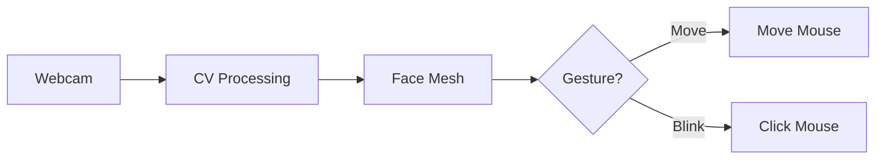

# 📊 Presentation Slides: AI Virtual Mouse

## **Slide 1: Title Slide**
# AI Virtual Mouse Using Eye-Gesture Recognition
**Presented By**: Samadhan Fuke  
**Department**: Computer Science / AI-DS  
*(Add College Logo Here)*

---

## **Slide 2: Introduction**
*   **Concept**: A hands-free system to control the computer mouse using only eye movements and blinking.
*   **Motivation**: To assist individuals with upper-limb disabilities (amputees, ALS patients) who cannot use physical peripherals.
*   **Innovation**: Replaces expensive hardware (eye-trackers costing $1000+) with a simple webcam and AI software.

---

## **Slide 3: Problem Statement**
*   **The Problem**: Traditional mice require fine motor skills. Prolonged usage causes Repetitive Strain Injury (RSI).
*   **The Need**: A contactless, intuitive, and accessible input method.
*   **The Approach**: utilize Computer Vision to track the "gaze" and "intent" of the user in real-time.

---

## **Slide 4: Objectives**
1.  **Face Tracking**: Robust detection of face and eye landmarks in real-time.
2.  **Cursor Control**: Accurate mapping of Iris movement to Screen coordinates.
3.  **Gesture Action**: Blink detection for Left/Right clicks.
4.  **Efficiency**: Must run on standard consumer CPUs without dedicated GPUs.

---

## **Slide 5: System Architecture**

*   **Input**: Video Stream.
*   **Core**: MediaPipe FaceLandmarker.
*   **Output**: Operating System Events (Mouse events).

---

## **Slide 6: Methodology - Eye Tracking**
*   **Landmark Extraction**: We extract 478 points.
*   **Iris Tracking**: Points 468-477.
*   **Centroid Calculation**: We find the mathematical center of the pupil.
*   **Interpolation**: The camera coordinates (640x480) are scaled to monitor coordinates (1920x1080) using `np.interp`.

---

## **Slide 7: Methodology - Blink Detection**
*   **EAR (Eye Aspect Ratio)**:
    *   Ratio of (Height of Eye) / (Width of Eye).
    *   **Open Eye**: EAR ≈ 0.25
    *   **Closed Eye**: EAR < 0.14
*   **Thresholding**: If EAR drops below 0.14 for 2 frames, a click is triggered.
    *   *Left Eye* = Left Click.
    *   *Right Eye* = Right Click.

---

## **Slide 8: Tools & Technologies**
*   **Python 3**: For rapid prototyping and logic.
*   **OpenCV**: For image manipulation (flipping, resizing).
*   **MediaPipe**: Google's state-of-the-art ML graph for face geometry.
*   **PyAutoGUI**: For controlling the mouse pointer.

---

## **Slide 9: Challenges & Solutions**
| Challenge | Solution |
| :--- | :--- |
| **Jittery Cursor** | Implemented **Smoothing Algorithm** (Moving Average). |
| **False Clicks** | Adjustable **EAR Threshold** and Debouncing. |
| **Mirrored Input** | Swapped Left/Right click logic to match visual mirror. |

---

## **Slide 10: Conclusion**
*   The system offers a **viable, low-cost** alternative to physical mice.
*   It is **accessible**, ** hygienic**, and **software-defined**.
*   Future work involves adding **Speech-to-Text** for a complete virtual interface.

---

## **Slide 11: Demo & Q&A**

*(Insert Screenshot or Video Demo Here)*

**Thank You!**  
*Any Questions?*
